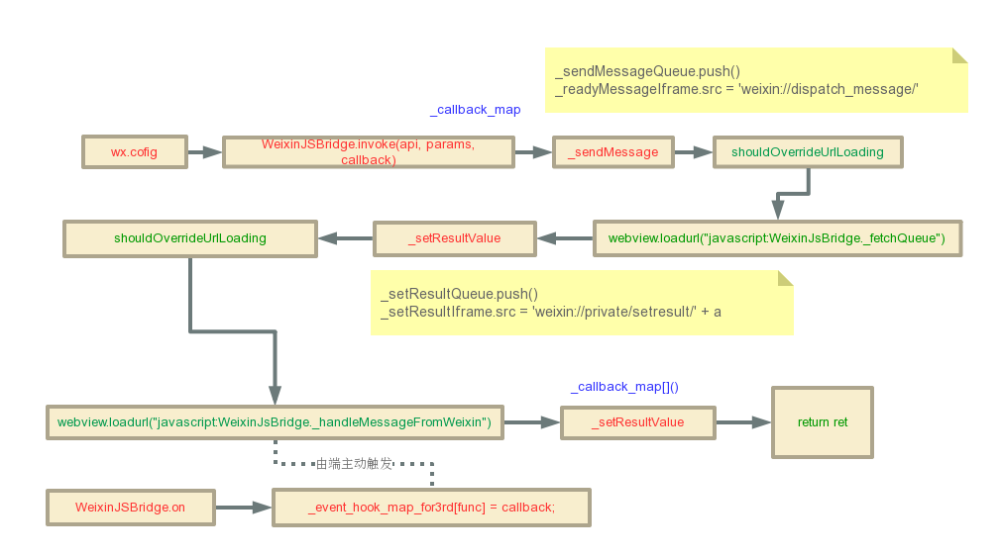

# JSSDK
>  微信JS-SDK分析

微信JS-SDK分为两部分，一部分是暴露给用户的接口`wx`，即[jweixin-1.2.0.js](http://res.wx.qq.com/open/js/jweixin-1.2.0.js)，是对底层接口`WeixinJSBridge`的封装，需要用户自己引入，有完善的接口文档：[微信JS-SDK说明文档](https://mp.weixin.qq.com/wiki?t=resource/res_main&id=mp1421141115)；一部分是直接注入到微信webview的，用户是没办法直接看到源代码的，我下载了微信官方提供的最新安卓版本：[weixin658android1060.apk](http://dldir1.qq.com/weixin/android/weixin658android1060.apk)，修改为`.zip`解压在`assets/jsapi/`发现了其注入的`wx.js`文件。下面就这两个js进行分析，剖析微信JS-SDK的技术细节。

## wx.js

- polyfills： `trim`、`reduce`
- `window._WXJS`：zeptojs->event、detect、fx、ajax、form、touch(`wx-swipe`、`wx-swipeLeft`、`wx-swipeRight`、`wx-swipeUp`、`wx-swipeDown`、`wx-doubleTap`、`wx-ta`p、`wx-singleTap`、`wx-longTap`)
- `WeixinJSBridge`：`invoke(call`)、`on`、`env`、`log`、`_fetchQueue`、`_continueSetResult`、`_handleMessageFromWeixin`

## jweixin.js